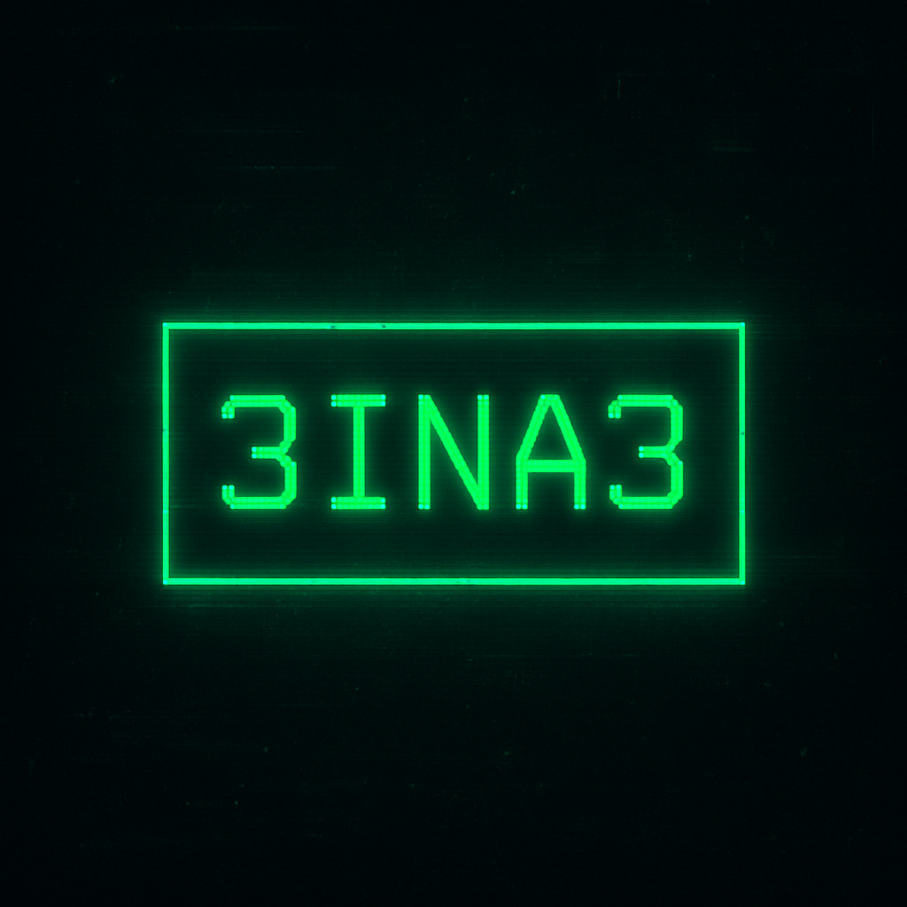

<h1 align="center"></h1>

<p align="center">
  
</p>
<p align="center">
  
</p>
<p align="center">
  
</p>


<p align="center">
  
</p>


---

## 🧠 SYSTEM PROFILE

```bash
> Developer:        Full Stack (Python / C++ / PHP / Web)
> Learning:         Cyber Security, Hacking, Networking
> OS:               Linux / Windows
> Favorite Editor:  VS Code, Terminal (Zsh)
